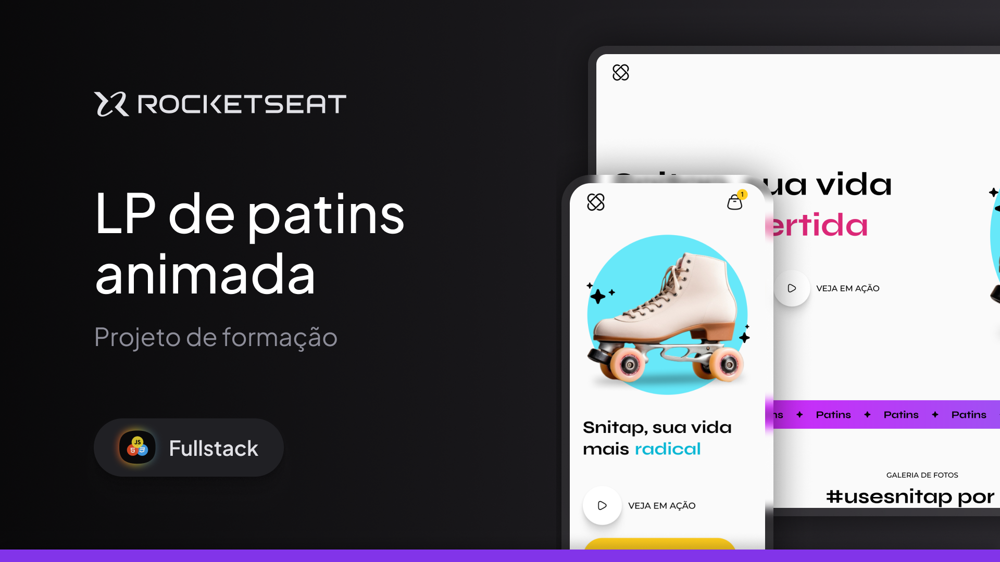

# Snitap — Landing Page 🛼


<p align="center">
  
  
  
  
</p>

<p align="center">
  <a href="https://snitap-landing-page.vercel.app">
    
  </a>
</p>

Landing page for **Snitap**, a fictional roller-skate brand, built as part of a [RocketSeat](https://www.rocketseat.com.br/) learning track. The project focuses on HTML and CSS fundamentals: responsive layout, animations, and semantic markup best practices, with no JavaScript or framework involved.

## About the project



The page features an animated hero section, an infinitely scrolling banner, a photo gallery with scroll-triggered animations, and a footer with social links — all built with semantic markup and modern CSS alone.

Original design available on Figma: [LP de Patins Animada](https://www.figma.com/community/file/1379866810042169871/lp-de-patins-animada)

## Changes from the original design

A few adjustments were made to the scrolling banner that aren't part of the original Figma file:

- Replaced the banner artwork with `assets/Patins.png` (the "Roller Skates" wordmark) and added `assets/Star 6.png` as a separator icon between each repetition, matching the intended look of the scrolling strip.
- Scoped the banner image sizing in `styles/banner.css` so the star icon (`img.star`) keeps its native `13x13px` size instead of inheriting the `108px` width applied to the wordmark image.
- Recalculated the `rolling` keyframe distance from `-132px` to `-169px` (wordmark width + gap + star width + gap) so the infinite scroll animation loops seamlessly with the star icon now part of the repeating unit.

## Technologies

- **HTML5** — semantic markup (`header`, `section`, `figure`, `figcaption`, `footer`, `nav`)
- **CSS3**, no preprocessors or frameworks:
  - Native **CSS Nesting** (`&` nested inside rules)
  - **Custom Properties** (`:root { --snitap-*, --text-*, --ff-base }`) for colors, typography, and scale
  - **Flexbox** and **CSS Grid** (`grid-template-areas`) for section layouts
  - **`@keyframes`** for entrance animations, icon rotation, and the infinite banner carousel
  - **Scroll-driven animations** (`animation-timeline: view()`) in the photo gallery
  - **Range media queries** (`@media (width <= 49rem)`) for mobile responsiveness
  - **Google Fonts**: [Inter](https://fonts.google.com/specimen/Inter), [Montserrat](https://fonts.google.com/specimen/Montserrat), and [Syne](https://fonts.google.com/specimen/Syne)
- **SVG / PNG** for icons and illustrations (logo, social icons, hero decorative elements, gallery photos)

There's no build tool, bundler, package manager, or runtime dependency — the project runs directly in the browser from `index.html`.

## Project structure

```
.
├── index.html            # Page markup (header, hero, banner, gallery, footer)
├── styles/
│   ├── index.css         # Entry point, imports the other files via @import
│   ├── global.css        # Reset, theme variables, and base typography
│   ├── header.css        # Fixed header with logo and cart
│   ├── hero.css          # Main section with text and image animations
│   ├── banner.css        # Infinite scroll strip with animated gradient
│   ├── gallery.css       # Photo grid with scroll-triggered animation
│   └── footer.css        # Footer with navigation and social links
└── assets/
    ├── logo.svg              # Brand logo
    ├── Patins.png            # Wordmark repeated in the scrolling banner
    ├── Star 6.png            # Separator icon between banner repetitions
    ├── Thumbnail.jpg         # Preview image used in this README
    ├── hero/                 # Decorative SVGs for the hero section
    ├── icons/                # UI and social icons (SVG)
    └── images/               # Gallery photos (PNG)
```

Styles are organized by section/component and centralized in `styles/index.css`, which imports them via `@import`, avoiding a single monolithic CSS file.

## Running the project

**Live demo:** [snitap-landing-page.vercel.app](https://snitap-landing-page.vercel.app) — deployed on Vercel, accessible from any device, including mobile.

To run it locally, no installation is required. Just open `index.html` directly in your browser, or serve the folder with any static server of your choice, for example:

```bash
npx serve .
```

## Best practices applied

- Semantic HTML with descriptive `alt` attributes on all images
- Centralized CSS variables for colors, typography, and spacing, avoiding magic values scattered across the code
- Mobile-first: a single breakpoint (`49rem`) reused across sections
- Separation of concerns: one CSS file per page section
- `preconnect` used for Google Fonts, reducing loading latency
- Image size controlled via CSS (`width`/`height`), independent of the source file's resolution


## 📷 Preview


## 👤 Author & 📄 License

Developed by **Janes Araujo**

- GitHub: [@Janesaraujo](https://github.com/Janesaraujo)

This project is licensed under the MIT License. See the [LICENSE](LICENSE) file for details.
# Roller-Skates---Landing-Page
